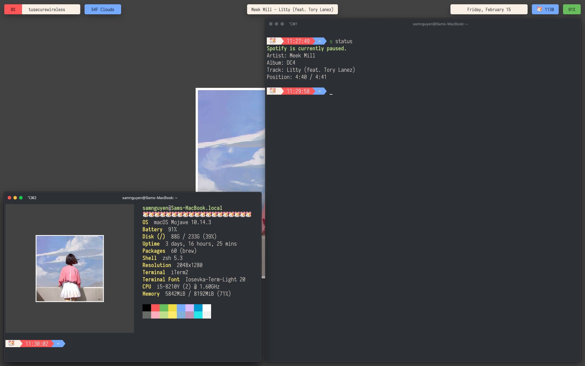

# SBar
A bar widget for Übersicht



## Usage
This widget has "6" components that display volume level, connected wifi network, weather, current Spotify info, date, time, and battery level.

## Installation
With installed, you can clone this repo directly into your widget folder:
```
git clone https://github.com/zzzeyez/Pecan.git $HOME/Library/Application\ Support/Übersicht/widgets/SBar
```

## Configuration
While this widget wasn't designed with modularity in mind, most of the CSS properties are variables and can be edited in `style.css`.

`weather.jsx` needs to be modified to display the weather for your zip code. In line 1 in the url, change `weather?zip=19120` to your zip code or location. It's also appreciated if you create your own API key for free at [OpenWeatherMap](http://openweathermap.org).

## What I Learned
A significant portion of this widget was created by examining [Pecan Bar](https://github.com/zzzeyez/Pecan), most notably using the same naming convention for CSS variables, a stripped down version of the `network` script as well as integrating the `battery` script into the corresponding JSX file.

This project was my first time using JSX/React, but using shell scripts and applescripts simplified the process signifacntly for me.
